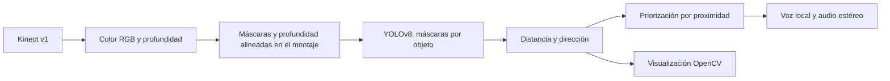

<div align="center">

# GuíaVisión
### Visión artificial que transforma el entorno en avisos de voz

**Segmentación de objetos · Profundidad RGB-D · Audio direccional**

Prototipo de ingeniería orientado a explorar tecnologías de apoyo para personas con discapacidad visual.

[Instalación](#instalación) · [Funcionamiento](#funcionamiento) · [Modelo](models/README.md) · [Seguridad](SECURITY.md)

</div>

---

GuíaVisión combina **Kinect v1**, **YOLOv8** y síntesis de voz local para identificar cinco categorías de objetos, estimar su distancia y anunciar su posición mediante audio estéreo. El procesamiento de inferencia está configurado para CPU.

**Autores:** Alvaro Mauricio Molina Guamanga y Nicolas Santiago Pantoja García.<br>
**Universidad Mariana · Ingeniería Mecatrónica · Investigación 2025**<br>
**Repositorio mantenido por:** [Nicolaspg12](https://github.com/Nicolaspg12) · [Créditos completos](AUTHORS.md)

## Resultados documentados

El informe de investigación respalda el funcionamiento del prototipo original:

| Ensayo | Resultado reportado |
| --- | --- |
| Recorridos en dos espacios de la Universidad Mariana | **81 alertas correctas de 100 oportunidades**, en 20 recorridos |
| Medición de distancia con Kinect v1 | **Error promedio menor del 2 %** en las cuatro clases evaluadas |
| Audio estéreo | Reproducción correcta y sincronizada, sin solapamientos |

Consulta [resultados, métricas y referencias al informe](docs/RESULTS.md) para conocer muestras, condiciones y alcance. Las modificaciones de esta edición requieren una comprobación de funcionamiento con el equipo original.

> El proyecto nació como una propuesta de segmentación semántica. La implementación disponible realiza **segmentación por instancias**: produce una máscara por objeto detectado. No segmenta todas las clases de cada píxel de la escena.

## Capacidades

| Componente | Implementación |
| --- | --- |
| Percepción | Máscaras YOLOv8 para carro, silla, cono, persona y planta |
| Profundidad | Kinect/OpenNI2, conversión de milímetros a metros |
| Distancia estimada | Promedio de más de diez muestras válidas dentro de cada máscara, como en la versión original |
| Rango configurado | Muestras mayores de 0,3 m y hasta 2,5 m; no es una garantía de precisión del sensor |
| Orientación | Izquierda, centro o derecha; inversión opcional según el montaje |
| Avisos | Voz local y balance estéreo; cola limitada y separación entre anuncios |
| Interfaz | Ventanas de segmentación y mapa de profundidad; teclas Q y A |

Las métricas corresponden a los experimentos del informe, no a una medición nueva de este repositorio. El trabajo documenta validación técnica en espacios reales; no incluyó pruebas con usuarios con discapacidad visual.

## Funcionamiento



El arranque comprueba el hash del checkpoint antes de cargarlo. Se conserva la configuración de streams del proyecto original. El cálculo presupone profundidad en milímetros y alineación RGB-D; deben verificarse en cada instalación. Tener imágenes del mismo tamaño no demuestra que estén alineadas y el programa no realiza una calibración automática.

## Instalación

**Entorno objetivo:** Windows de 64 bits, Python 3.11, Kinect v1 con alimentación y conexión USB, controladores compatibles con OpenNI2, salida de audio estéreo y una voz española instalada en Windows. La compatibilidad exacta del controlador depende del equipo; el SDK de Kinect por sí solo no garantiza soporte OpenNI2.

```powershell
git clone https://github.com/Nicolaspg12/guiavision-kinect.git
cd guiavision-kinect
py -3.11 -m venv .venv
.\.venv\Scripts\python.exe -m pip install --upgrade pip
.\.venv\Scripts\python.exe -m pip install -r requirements.txt
```

Instala el runtime OpenNI2 y su controlador desde fuentes de confianza, con la misma arquitectura que Python. No se incluyen instaladores ni se descargan controladores automáticamente. Las dependencias tienen límites de versión, pero **no constituyen un entorno congelado y auditado**.

Comprueba primero el modelo sin deserializarlo:

```powershell
.\.venv\Scripts\python.exe -m guiavision --verify-model
```

Inicia el prototipo con la ruta de tu instalación:

```powershell
.\.venv\Scripts\python.exe -m guiavision --openni-redist "C:\Program Files\OpenNI2\Redist"
```

Se mantiene por defecto la inversión izquierda/derecha del montaje original. Usa `--no-mirror` únicamente si las comprobaciones físicas de tu montaje requieren desactivarla. También se puede definir `OPENNI2_REDIST`. Ejecuta `python -m guiavision --help` para consultar las opciones sin cargar bibliotecas del sensor.

| Tecla | Acción |
| --- | --- |
| **Q** | Salir y liberar los recursos |
| **A** | Activar o desactivar avisos de voz |

## Estructura

```text
guiavision/           Aplicación modular y validación del checkpoint
models/              Modelo entrenado, hash y ficha técnica
tests/               Pruebas sin cámara ni deserialización del modelo
docs/                Arquitectura, procedencia y protocolo de validación
.github/             Comprobaciones automáticas y Dependabot
README.md            Presentación e instrucciones
SECURITY.md          Protección, alcance y reporte de vulnerabilidades
LICENSE              GNU AGPL v3
```

Esta edición toma como base la carpeta original `codigo final`. Se consolidaron sus cuatro módulos; no se incluyen fotografías, cachés, scripts duplicados ni el checkpoint genérico de COCO, cuyas clases no coinciden con el modelo personalizado.

## Validación y límites

```powershell
python -m unittest discover -s tests -v
python -m compileall -q guiavision tests
```

Las pruebas verifican integridad del modelo, rechazo de sustituciones y direcciones. **No ejecutan inferencia, no prueban OpenNI2 ni validan voz o distancias reales.** Antes de una demostración debe completarse el [protocolo con hardware](docs/VALIDATION.md).

GuíaVisión **no es un dispositivo de movilidad validado** y no debe sustituir bastón, perro guía ni asistencia humana. Las cinco clases no cubren todos los obstáculos; ausencia de detecciones no significa camino libre. La oscuridad, oclusiones, superficies reflectantes, límites del sensor y desalineación pueden producir errores. El audio también puede retrasarse o fallar.

## Autoría, licencia y uso

Autoría académica: Alvaro Mauricio Molina Guamanga y Nicolas Santiago Pantoja García (2025). Distribuido bajo **GNU AGPL-3.0-only**, en consonancia con el uso de Ultralytics YOLO. Al reutilizar o distribuir, conserva los avisos de autoría y cumple las obligaciones de entrega de código fuente que correspondan según la licencia. Consulta [LICENSE](LICENSE), [AUTHORS.md](AUTHORS.md) y [THIRD_PARTY_NOTICES.md](THIRD_PARTY_NOTICES.md).

La AGPL permite copiar, modificar y usar comercialmente bajo sus condiciones. **No impide técnicamente la copia ni prohíbe todos los usos indebidos.** Este repositorio público no concede exclusividad sobre el código. Se solicita un uso responsable y respetuoso de la privacidad; esta petición no añade restricciones incompatibles con la licencia.

Para propuestas técnicas, utiliza las issues del repositorio. Consulta [CONTRIBUTING.md](CONTRIBUTING.md) antes de enviar cambios.
